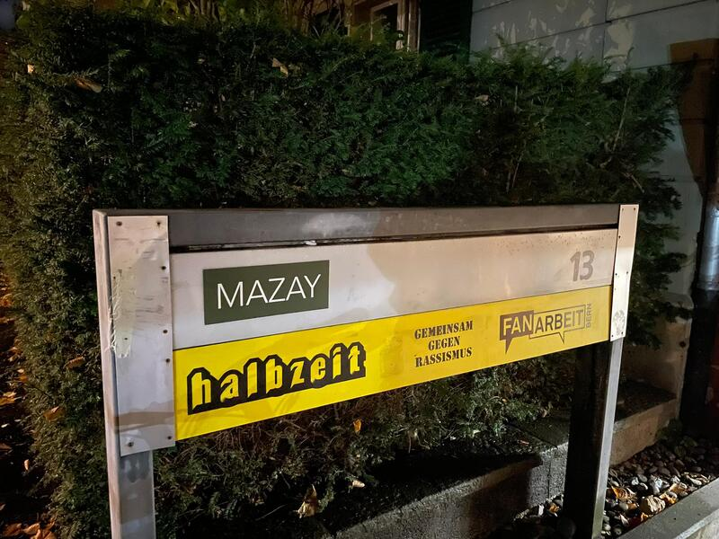
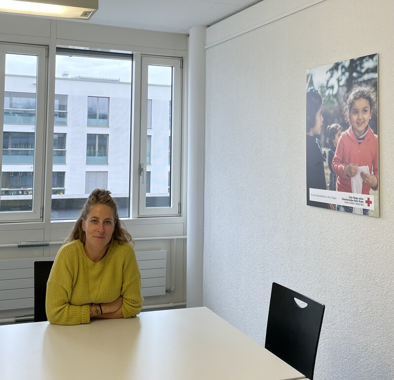

+++
title = "Integration - ein Fremdwort für ehemalige Flüchtlingsfrauen?"
date = "2022-11-30"
draft = false
pinned = true
tags = ["Flüchtlinge", "Integration", "Frauen", "Schule", "Reportage"]
image = "heimat.jpeg"
description = "In diesem Artikel..."
footnotes = "In der Fusszeile können zum Beispiel Bildquellen angegeben werden. Dieser Text ist abgetrennt durch eine Linie und etwas kleiner."
+++

In der Schweiz leben viele geflüchtete Frauen. Sie beherrschen nicht wirklich eine der Landessprachen und an kulturellen Kenntnissen sowie sozialen Kontakten mangelt es ihnen. Sie sind nicht integriert. Doch was steht zwischen Frauen und ihrer Integration? Und wie lassen sie sich diese Hürden bewältigen? Wir haben einen Frauenabend für Flüchtlinge besucht und sind diesen Frage auf den Grund gegangen. 


Um fünf Uhr, steht auf dem Flyer, beginnt der Frauenabend. Organisiert wird dieser durch den Verein Mazay. Er unterstütz und begleitet Flüchtlinge bei ihrer Integration. Wir treffen früher bei der verabredeten Stelle, einem Café, ein und warten deshalb vor dem Eingang. Dort lernen wir Amira (Name geändert) kennen. Sie ist eine Afghanin, die aus ihrem Heimatland geflüchtet ist. Als wir mit ihr einige Worte austauschen, zeigt sich ihre offene und freundliche Persönlichkeit. Im Verlauf des Abends lernen wir sie noch näher kennen. Nicht viel Zeit ist verstrichen, als Edith, ein Mitglied des Vereins Mazay, sich zu uns Wartenden gesellt. Da sie den Schlüssel für das Café nicht hat, warten wir inzwischen zu viert. Währenddessen erzählt uns Edith, wie schade sie findet, dass oft nur über Flüchtlinge geredet wird, aber nicht mit ihnen. Der Verein Mazay beweist uns, es geht auch anders. 

Eine Weile später treten wir auch schon ins gemütlich eingerichtete Café ein. Pinar, die Präsidentin des Vereins, ist eingetroffen und hat die Tür aufgeschlossen. Gemeinsam mit den anderen arrangieren wir für den Frauenabend die Tische und Stühle zu einer Ellipse. An einer Bar werden süsslich duftende Zimtschnecken, Kuchen und weiteres Gebäck ausgebreitet. Bedarf es einen Durst zu stillen, kann man sich dank Wasserkocher warmen Tee zubereiten. Auf Tischen werden Gläser, Stifte und Bänder fürs Basteln von Windlichtern bereitgestellt. 

#### Mit geflüchteten Frauen reden

Immer mehr Frauen treffen ein und nehmen an der aus Tischen und Stühlen geformten Ellipse Platz. Wir entscheiden uns, ebenfalls Platz zu nehmen an der Tischrunde, während noch immer weitere Frauen sich zu diesem Treffen gesellen. Neben uns setzt sich eine Frau. Sie stellt sich uns als Derya (Name geändert) und als eine gebürtige Türkin vor. Wir kommen mit ihr ins Gespräch und stellen fest, man kann sich auch ohne perfekte Deutschkenntnisse sehr gut verstehen. 

> "Um meine Integration habe ich mich selbst gekümmert. Niemand hat mir geholfen." 
>
> *Elenya (Name geändert), ehemalige syrische Flüchtlingsfrau*

Edith, Pinar und eine weitere Frau, die Mitglied des Vereins Mazay ist, erläutern kurz das lockere Programm des Abends: Essen, Trinken, Verzieren von Windlichtern und Schwatzen. Kaum ist der Abend offiziell eröffnet, beginnen die einen Frauen Gespräche und die anderen machen sich eifrig ans Verzieren von Windlichtern. Währenddessen hängen wir, von einer familiären und freundschaftlichen Atmosphäre im Café umschlungen, an Amiras Lippen, die uns erzählt, wie schwierig soziale Integration einst für sie gewesen ist. Sie sagt, sie habe in der Vergangenheit mit vielen Problemen zu kämpfen gehabt und ihr habe niemand geholfen. Denn Kontakt zu knüpfen sei damals aufgrund von Sprachbarrieren noch nicht möglich gewesen. Es sei schwierig gewesen, nichts zu verstehen. Aber seit sie Teil des Vereins Mazay ist, sei vieles einfacher geworden. Der Verein habe ihr "wirklich sehr geholfen".

#### Hürden

Nach Amiras Schilderungen ist uns klar, wie wichtig der Beitrag von Organisationen wie dem vom Verein Mazay zur Integration von geflüchteten Frauen ist. Gäbe es diese Frauenabende nicht, würden viele geflüchteten Frauen sich schlichtweg nicht integrieren können. Dies kann verschiedene Gründe haben. Wie Amira gibt es Frauen, die nicht gut Deutsch sprechen und ihnen fällt es daher schwer, aus eigener Hand ihr soziales Netzwerk auszubauen. So bekräftigt Tamara-Elizabeth Iskra, die Delegierte für Integration in der Stadt Biel, "die Sprache ist das Element, das zu allen anderen Bereichen Zugang schafft." Ebenfalls leidet die Integration von geflüchteten Frauen darunter, dass diese niemanden für die Betreuung ihrer Kinder haben. Amira hat Kinder und nur weil jemand auf ihr jüngstes Kind aufpasst, ist es ihr möglich, den Frauenabend überhaupt zu besuchen. Dieses Problem der Kinderbetreuung verdeutlicht auch, weshalb Frauen bevorzugter Frauenprogramme besuchen. Denn Frauen können sich mit ihrem Mann mit der Betreuung ihrer Kinder abwechseln, wenn ihre Kurse nicht parallel stattfinden. Eine Studie des SKMR - des schweizerischen Kompetenzzentrums für Menschenrechte - belegt, "Sprachkurse werden wegen fehlender Kinderbetreuung häufig von Männern besucht". In dieser Studie wird auch auf einen weiteren frauenintegrationshemmenden Faktor hingewiesen, so wird behauptet, Beschäftigungsangebote seien eher auf Männer ausgerichtet.

Pinar gesellt sich zu uns. Wir unterhalten uns über Schwierigkeiten, die bei der Integration aufkommen. Dabei kommt das Thema Trauma auf. Sie erzählt uns, dass viele illegal in die Schweiz reisen und dabei verfolgt werden. Unter diesen vielen sind tausende Frauen, die auf ihrer Flucht Szenen sehen, die sich tief in ihr Gehirn einbrennen. Als wären diese traumatisierenden Erlebnisse nicht genug, erfahren Frauen während ihrer Flucht oftmals sexuelle Übergriffe. Vor dem Hintergrund all dieses Grauens sollen Frauen sich integrieren. Es ist selbsterklärend, dass ihnen Vertrauen zu Menschen fehlt und Angst vor erneuten Übergriffen sie zurückhaltend macht. 

> Wir alle hatten Vertrauensschwierigkeiten. Die Schweiz war ein neues Land mit einer neuen Kultur; wir verstanden die Menschen nicht.
>
> *Asia, ehemalige afghanische Flüchtlingsfrau*

Asia ist als kleines Mädchen den Konflikten in Afghanistan entflohen und somit zu einem Flüchtlingsmädchen geworden. Inzwischen ist sie erwachsen und eine ehemalige Flüchtlingsfrau - ehemalig, da Flüchtlingsfrauen definitionsgemäss sich noch auf der Flucht befinden. Sie spricht für ihre Familie und sich selbst: "Wir alle hatten Vertrauensschwierigkeiten. Die Schweiz war ein neues Land mit einer neuen Kultur \[...]; wir verstanden die Menschen nicht." Sie beschreibt ein Problem vieler geflüchteten Frauen. Einerseits haben Frauen Schwierigkeiten damit, die Kultur der Schweizer zu verstehen und andererseits ist es schwierig, ihre eigenen kulturellen Gepflogenheiten dem Alltag in der Schweiz anzupassen. Schweizer und Schweizerinnen wirken durch ihre Förmlichkeit kalt und dies kann erschreckend für Frauen sein, die aus Kulturkreisen stammen, in denen offener miteinander umgegangen wird. In der Schweiz ist jeder Besuch anzukündigen und jeder Termin muss vorvereinbart werden. In anderen Ländern taucht man hingegen spontan für einen Kaffeeplausch auf und Termine werden gar nicht abgesprochen, man geht unangemeldet zum Arzt.

Oftmals steht Religion eine weitere Integrationshürde für Frauen dar. Dies wird deutlich in der Kleidung. Viele geflüchteten Frauen sind Musliminnen und halten sich daher an bestimmte Kleidervorschriften. Diese Kleidervorschriften entsprechen nicht den Normen der schweizerischen Garderobe, was Unsicherheiten bei Frauen zu ihrer beruflichen Integration auslöst. Sie befürchten, ihren Traumberuf nicht ausüben zu können. So erwähnt Asia Bedenken, ausgelöst durch das Kopftuch. In der Zukunft möchte Asia nämlich ein Kopftuch anziehen, weiss aber nicht, ob das Nachteile birgt.

Nicht selten geschieht es, dass bei Integration Kompromisse von Flüchtlingen verlangt werden. Obwohl Integration auch für Akzeptanz neuer Kultur und Religionen steht, ist es Frauen beim Ausüben gewisser Berufe nicht erlaubt, ein Kopftuch zu tragen. Zu diesen Berufen gehört der Lehrberuf. 

#### Angebote nur für Frauen

Fast alle erwähnten Integrationshürden wirken Frauenangebote entgegen, an denen nur Frauen teilnehmen dürfen. Deutlich beweist dies der vom Verein Mazay organisierte Frauenabend. Denn bei diesem Frauenabend haben geflüchtete Frauen die Möglichkeit, Deutsch mit Schweizerinnen sowie anderen Flüchtlingen zu sprechen. Sie lernen dabei neue Menschen kennen und können ihr soziales Netzwerk ausbauen. Somit wird ihnen die Bürde des alleinigen Aufbaus eines sozialen Netzwerks abgenommen. Da das Angebot ein Frauenabend ist, können Ehemänner oder Onkeln auf die Kinder aufpassen. Damit wäre das problem der Kinderbetreuung gelöst. Ausserdem können Frauen am Frauenabend Traumata verarbeiten, indem sie sich gegenseitige Erfahrungen austauschen. In diesem Umfeld von Menschen, die Ähnliches erfahren haben, erhalten sie Verständnis. Frauen, die Männer gegenüber Misstrauen hegen wegen erlebten Vergewaltigungen, erhalten die Möglichkeit, integriert zu werden und können nebenbei ihr Vertrauen in Menschen erneuern. Denn sie müssen sich nicht durch Männer gefährdet fühlen, da keine Männer anwesend sind. Nicht zuletzt können sich Frauen durch das Sprechen mit Schweizerinnen über die Schweizer Kultur informieren. Schweizerinnen können ihnen auch helfen bei der Aufklärung von Unsicherheiten, die sich aufgrund der Religion ergeben.

Lara Heliotis arbeitet als Sozialarbeiterin des Schweizerischen Roten Kreuzes. Sie erklärt, Frauen legen Wert darauf, unter sich zu sein. Daher sprängen sie mehr auf Frauenangebote als auf gemischte Angebote an. Nicht nur beseitigen Frauenangebote daher Hürden, sondern erhöhen auch Teilnehmerbereitschaft von Frauen für Integrationsprogramme und fördern somit die Integration von geflüchteten Frauen. 

### Links

[So können Links angegeben werden](https://www.lernblog.org). Wenn man in den `Markdown`-Modus wechselt, sieht man auch, welcher Link hinterlegt worden ist.

### Zitate

> «Zitate können hervorgehoben werden.»
>
> *Autor mit [Link zur Quelle](https://www.lernblog.org)*

Die Quellenangabe muss *kursiv* geschrieben werden, damit sie als Fusszeile erkannt wird.

### Liste

So sieht eine Liste aus:

* Nam de isto magna dissensio est.
* Mihi, inquam, qui te id ipsum rogavi?
* Haec et tu ita posuisti, et verba vestra sunt.
* Idem fecisset Epicurus, si sententiam hanc, quae nunc Hieronymi est, coniunxisset cum Aristippi vetere sententia.

### Nummerierte Liste

Und so eine nummerierte Liste:

1. Nam de isto magna dissensio est.
2. Mihi, inquam, qui te id ipsum rogavi?
3. Haec et tu ita posuisti, et verba vestra sunt.
4. Idem fecisset Epicurus, si sententiam hanc, quae nunc Hieronymi est, coniunxisset cum Aristippi vetere sententia.

## Bilder

Bilder werden mit dem `+`-Symbol eingefügt.

**Empfehlung für Bilder**: Meist empfiehlt sich, ein Bild ganz zuoberst im `Inhalt`-Feld einzufügen. Zusätzlich sollte man dieses auch im `Bild`-Feld angeben, damit es in der Blogübersicht erscheint.

### Tipps zu Bildgrössen

Ein Richtwert für Bilder ist, dass diese wenn möglich nicht grösser als `400kb` sein sollten. Man kann sie so verkleinern, dass die Breite höchstens `1200px` gross ist. Dies ist für die meisten Bildschirme mehr als genug.

### Bildunterschrift

Wenn bei einem Bild ein `ALT TEXT` erfasst wird, so wird dieser als Bildunterschrift im Artikel angezeigt.

## Horizontale Linie

Eine Horizontale Linie kann man entweder durch ein `
` einfügen oder indem man im `Markdown`-Modus drei Striche `---` einfügt. So sieht die Linie aus:

- - -

## Lead


Oft haben Artikel unterhalb des Haupttitels einen einführenden Lead, der etwas grösser dargestellt wird.


``\
Ein Lead steht zwischen zwei solchen Blöcken.\
``

## Kasten


In dieser Box können Texte, Bilder, Videos oder andere Inhalte dargestellt werden.


``\
Der Inhalt einer Box muss wie hier von zwei Blöcken umgeben werden.\
``


Wird ein Titel angegeben, so kann die Box ausgeklappt werden.

Dies eignet sich auch für längere Inhalte.

Auch Bilder können in eine Box gepackt werden.


``\
Wird ein Titel angegeben, so kann die Box ausgeklappt werden.\
``